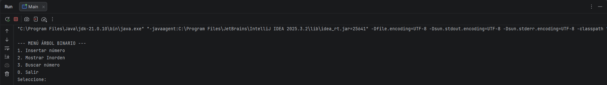
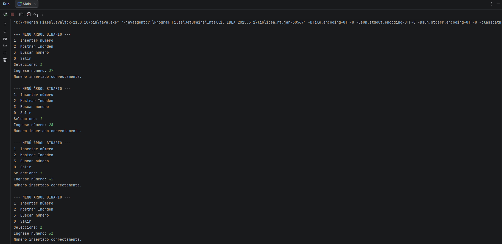
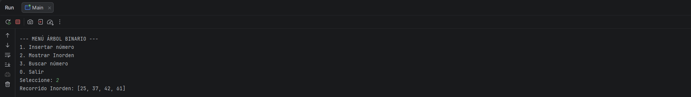

# Árbol Binario de Búsqueda en Java

**Estudiante:** Leyniker Ferley Celis


## 1. Objetivo del Proyecto

Comprender el funcionamiento de los **árboles binarios de búsqueda (BST)** e implementar un programa en Java que permita interactuar con esta estructura de datos mediante un menú en consola.

El proyecto busca aplicar conceptos fundamentales como inserción, recorrido y búsqueda de datos, además de fomentar buenas prácticas de programación.


## 2. ¿Qué es un Árbol Binario?

Un **árbol binario** es una estructura de datos en forma jerárquica donde cada nodo puede tener como máximo dos hijos:

* Hijo izquierdo
* Hijo derecho

En un **árbol binario de búsqueda (BST)** se cumple la siguiente regla:

* Los valores menores van al subárbol izquierdo
* Los valores mayores van al subárbol derecho

Esto permite organizar los datos de manera eficiente.


## 3. Recorrido Inorden

El recorrido **inorden** sigue este orden:

1. Subárbol izquierdo
2. Nodo raíz
3. Subárbol derecho

Este recorrido es importante porque **devuelve los valores ordenados de menor a mayor**.

📌 Ejemplo:

Si insertamos:
50, 30, 70, 20, 40

El recorrido inorden será:
👉 20, 30, 40, 50, 70


## 4. Funcionalidades del Programa

El programa permite:

* Insertar números en el árbol 
* Mostrar el recorrido **inorden (ordenado)**
* Buscar un número dentro del árbol 
* Interacción mediante menú en consola


## 5. Estructura del Proyecto

```
src/
│
├── Main.java
└── bst/
    ├── Node.java
    └── BinarySearchTree.java
```


## 6. Instrucciones de Ejecución

1. Abrir el proyecto en IntelliJ IDEA
2. Ejecutar la clase `Main.java`
3. Usar el menú en consola:

```
1. Insertar número
2. Mostrar Inorden
3. Buscar número
0. Salir
```


## 7. Ejemplo de Ejecución

```
--- MENÚ ÁRBOL BINARIO ---
1. Insertar número
2. Mostrar Inorden
3. Buscar número
0. Salir

Seleccione: 1
Ingrese número: 50

Seleccione: 1
Ingrese número: 30

Seleccione: 2
Recorrido Inorden: [30, 50]

Seleccione: 3
Número a buscar: 30
Número encontrado.
```


## 8. Capturas de Pantalla

Menú Interactivo:


Inserción de Números:


Mostrando Recorrido Inorden:



## 9. Tecnologías Utilizadas

* Java
* IntelliJ IDEA
* GitHub


